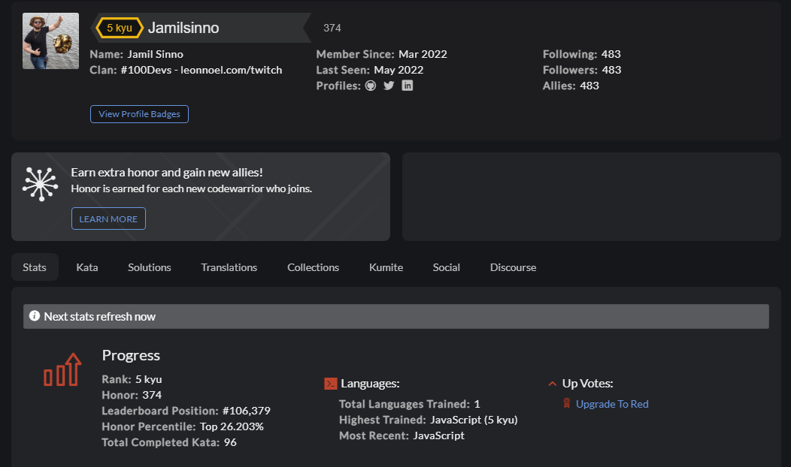

# Codewars challenges
This file is to track all the codewars problems I have solved. 

Note: As of May 9, 2022, I changed the way I upload solutions. Each codewar problem solved will get its own file.

## How It's Made:

Everyday I solve at least one codewars problem.

**Tech used:** JavaScript

## Optimizations
I sometimes go back to old solutions and refractor my code.

## Lessons Learned:
The biggest I learned was how to break down a question. Some questions have specific wording that will change the way you solve the problem. I also learned how to manage my frustration when code doesn't work. 